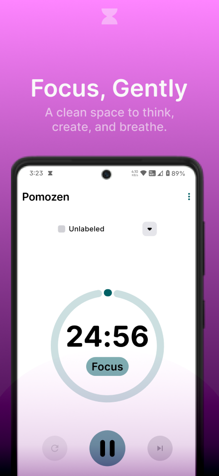
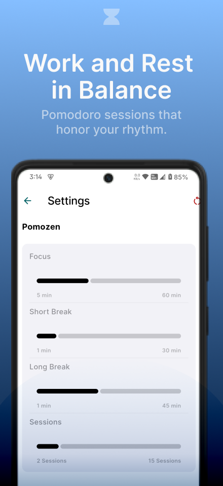
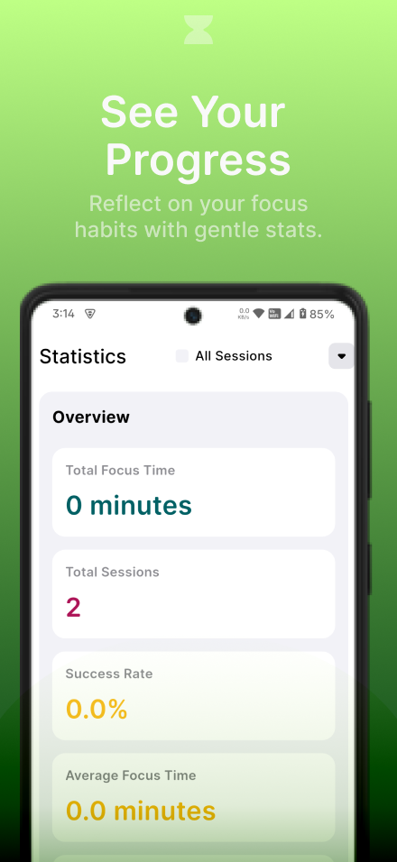
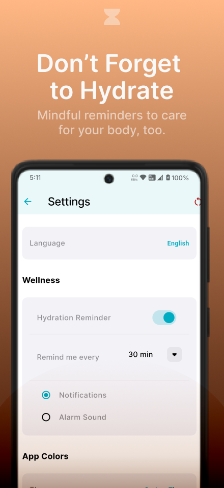
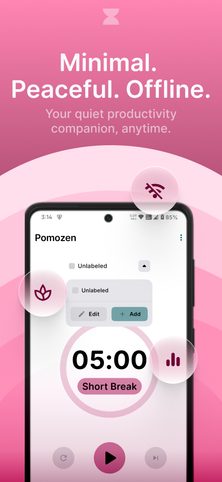

# ⏳ Pomozen

  &nbsp;&nbsp;&nbsp;
  &nbsp;&nbsp;&nbsp;
  &nbsp;&nbsp;&nbsp;
  &nbsp;&nbsp;&nbsp;
  
  

  

**Pomozen** is a modern, open-source Pomodoro timer app designed to boost productivity and focus.  
It applies the Pomodoro Technique—structuring work into focused intervals (typically 25 minutes)  
followed by short breaks. This systematic approach helps combat mental fatigue, maintain  
concentration, and improve efficiency in work or study.

---

## ✨ Key Features

- **📊 Comprehensive Statistics**  
  Track focus sessions, break times, and productivity patterns. Custom labels let you track
  time spent on specific tasks, activities, or anything you want.

- **⏰ Customizable Reminders**  
  Stay on track with personalized notifications. Smoothly transition between focus and break  
  periods.

- **⚡ Timer Presets**  
  Quickly select timer values using predefined presets—no need to manually enter durations every time.

- **💧 Hydration Reminder**  
  Get timely reminders to drink water and stay hydrated throughout your day.

- **🧘 Minimal Design**  
  Clean, focused interface built with minimalism at its core—balanced spacing, calm colors, and no  
  distractions.

- **📴 Offline Support**  
  No internet? No problem. All features, timers, and logs work offline.

- **⚙️ Fully Customizable Timer**  
  While the default Pomodoro cycle is 25/5/15, you can fine-tune focus time, short/long breaks, session count, and reminder behavior to match your personal workflow.

---

## 📸 Screenshots

  
  
  
   
  
  

---

## 🔐 Privacy First

Pomozen has a **strict no data collection policy**.  
All session logs and preferences are stored **only on your device**—never sent to external servers  
or third parties.

---

## 🧰 Tech Stack

- **Flutter** – UI toolkit for building cross-platform apps
- **Dart** – Programming language behind Flutter
- **GetX** – Simple, fast state management and routing

---

## 🚀 Getting Started

1. Download the latest release from the [Releases Page](#).
2. Install the APK on your Android device.
3. Open **Pomozen** and adjust your Pomodoro settings to fit your workflow.

---

## 🧑‍💻 Contributing

Contributions are welcome and appreciated!  
If you'd like to improve Pomozen, feel free to:

- Report bugs
- Suggest features
- Submit pull requests

Please read the [Contributing Guide](CONTRIBUTING.md) (coming soon) for details.

---

## 📄 License

Pomozen is licensed under the [Apache License 2.0](https://www.apache.org/licenses/LICENSE-2.0).

---

## 🙌 Credits

- Thanks to [@abisri99](https://github.com/abisri99) for feedback and suggestions.
- Built with [Flutter](https://flutter.dev), [GetX](https://pub.dev/packages/get), and open-source love

---

> Made with ❤️ using Flutter, Dart, and GetX.
